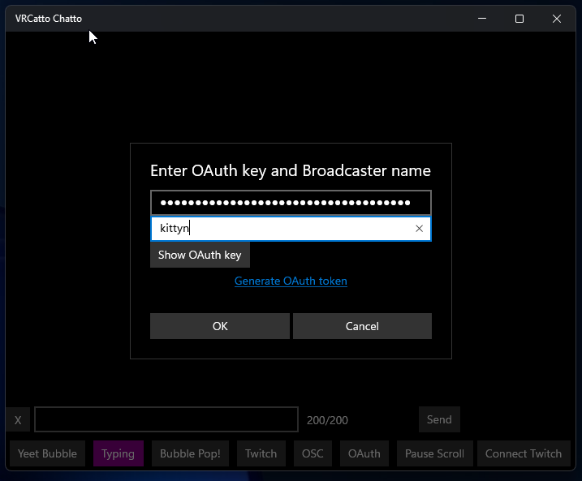

Nice chat app that I made for myself using gpt4 to generate UWP boilerplate and help debug error messages.

Will upload to the windows store once Microsoft approves my partner account.

Most buttons are toggles.

Yeet bubble removes your vrchat bubble and bubble pop enables/disables the pop audio.  

You must enter your twitch oauth the first time you connect to twitch if you want to use that functionality.

After entering the oauth, just tap connect.

Subsequent sessions you can just click the Connect Twitch button as it is stored in Windows persistent storage.  In a later version this will be optional.

OSC & Twitch are toggleable so you can send to one, both or none if you just want to leave a note for yourself in the scrollback.
